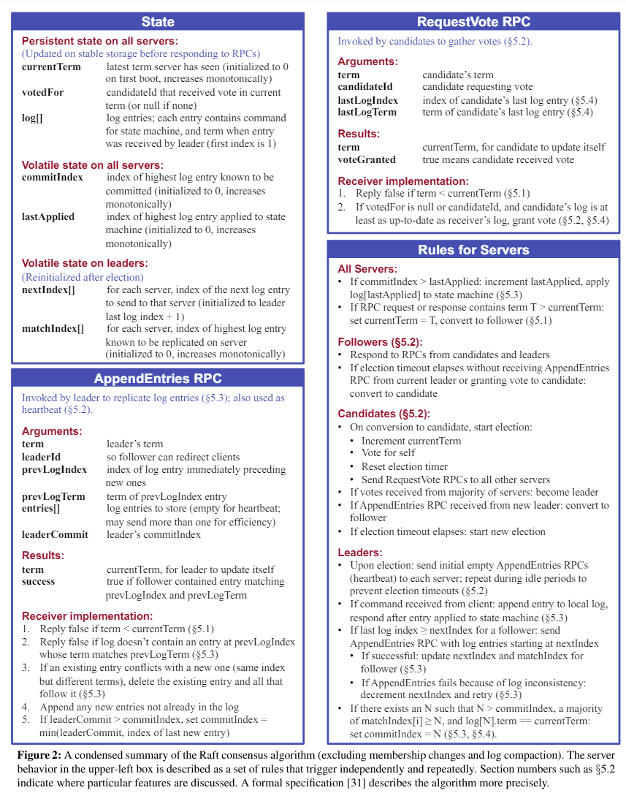



__Code:__ https://github.com/CIRCIRCIRCLE/Distributed_System-6.824

## Lab 1: MapReduce
__Overview:__ This Lab implements a basic MapReduce framework in C++, utilizing condition variables and mutexes for efficient timeout monitoring. Communication between the Master and Workers is achieved through RPC connections.

### Implementation Mechanism of Map and Reduce
<figure style="text-align:center; ">
  
  <figcaption>(Execution of MapReduce image source: Hu et al.)</figcaption>
</figure>

1. Map Function:    
__Objective:__ Split the contents of the input file into key-value pairs.   
__Implementation:__ Read the input file content and split it into words, each word being a key with the value set to "1".   
__Process:__   Read the file content into a string -> Split the string into words, generating a series of key-value pairs (each word corresponds to a key-value pair, with the value being "1") -> Return the list of key-value pairs.

2. Reduce Function:   
__Objective:__ Aggregate intermediate results and calculate the total count for each key (word).   
__Implementation:__ Read intermediate result files and aggregate the values of the same key.    
__Process:__
    - Shuffle Function: Read all intermediate result files and aggregate the values of the same key.
    - ReduceF Function: Calculate the total value for each key and output the final result.

### Mechanism of Timing and Timeout Retransmission
1. __Start Timer When Assigning Tasks:__ Start a timer thread to monitor task completion each time a task is assigned.
2. __Timer Thread Waits for Timeout:__ Use pthread_cond_timedwait() to wait for a specified time. If the task is not completed before the timeout, continue waiting.
3. __Cancel Timer Before Task Completion:__ When the task is completed, the Worker notifies the Master to cancel the timer.
4. __Reschedule Task on Timeout:__ If the task is not completed before the timeout, the Master marks the task as timed out and reschedules it.     
__Notes:__ `pthread_cond_timedwait()` uses operating system-provided synchronization primitives, allowing efficient waiting for events or timeouts without consuming CPU resources. During the wait, the thread yields the CPU, allowing other threads to run, thereby improving the overall system efficiency. Compared to busy-waiting with the sleep() function, pthread_cond_timedwait() effectively avoids wasting CPU resources.   

### RPC Principles
1. ButtonRPC Library:
    - ButtonRPC is a lightweight RPC framework used for remote procedure calls.   
    - It allows communication between the Master and Workers to assign tasks and report status.   
2. RPC Call Process:
    - The Master acts as an RPC server, defining and binding various RPC interfaces, such as task assignment and status updates.
    - Workers act as RPC clients, connecting to the Master and calling these interfaces to obtain tasks or report task completion.
    - Using the concise API of the ButtonRPC library for network communication and data transfer enables efficient collaboration between the Master and Workers.

## Lab2: RAFT
__Basic Overview:：__ Raft is a consensus algorithm designed to achieve distributed consistency among multiple nodes in a distributed system. Its main functionalities include Leader Election, Log Entries Append, and Raft State Persistence.    

### Summary of Raft Consensus Algorithm
__Official Visualization Web:__ https://raft.github.io/
<figure style="text-align:center; ">
  
  <figcaption>Summary of Raft Consensus Algorithm</figcaption>
</figure>

### Basic Concepts
1. Node States   
Leader: Handles client requests and manages log replication.   
Candidate: A node attempting to become a leader during leader election.
Follower: Passively receives and applies instructions from the leader.

2. Data Structures   
_LogEntry:_ Represents a log entry, containing the command and term number.       
_Persister:_ A persistent storage class used to save logs and state.    
_AppendEntriesArgs and AppendEntriesReply:_ Parameter classes for log replication requests and responses.       
_RequestVoteArgs and RequestVoteReply:_ Parameter classes for vote requests and responses.   
  

3. Concurrency Control   
locker：A mutex class used to protect shared data.    
cond： A condition variable class used for thread synchronization.   

### Raft core parts realization
#### Leader Election
Leader Election is the process by which nodes in a Raft cluster elect a leader from among themselves. The leader is responsible for handling all client requests and coordinating the replication of log entries to other nodes (followers). The steps involved in leader election include:

1. Candidate Declaration: A node transitions from follower to candidate and increments its term.
2. Vote Request: The candidate sends out vote requests to other nodes.
3. Majority Vote: If the candidate receives votes from a majority of the nodes, it becomes the leader.
4. Term Adjustment: If a node receives a request with a higher term, it updates its term and becomes a follower.

#### Log Entries Append 
Log Entries Append refers to the process of replicating log entries from the leader to the followers to ensure consistency across the cluster. The key steps include:

1. __Leader Receives Command:__ The leader receives a command from a client.
2. __Log Entry Creation:__ The leader creates a new log entry and appends it to its own log.
3. __AppendEntries RPC:__ The leader sends AppendEntries RPCs to followers to replicate the log entry.
Log Consistency Check: Followers check if the log entry matches the previous log entry in terms of index and term.
4. __Acknowledgment and Commit:__ Once a majority of followers have appended the entry, the leader commits the entry and applies it to the state machine, notifying followers to do the same.

#### State Persistence
State Persistence is the mechanism by which the Raft nodes save their state to stable storage to survive crashes and reboots. This includes the current term, votedFor (the candidate that received the node's vote in the current term), and the log entries. Key aspects include:

1. __Serialization:__ Converting the in-memory state into a format suitable for storage.
2. __Writing to Stable Storage:__ Saving the serialized state to disk.
3. __Deserialization:__ Loading the state from disk back into memory upon restart.
4. __Consistent State Updates:__ Ensuring that state updates (such as changes to the current term or new log entries) are consistently reflected in the persistent storage.。
