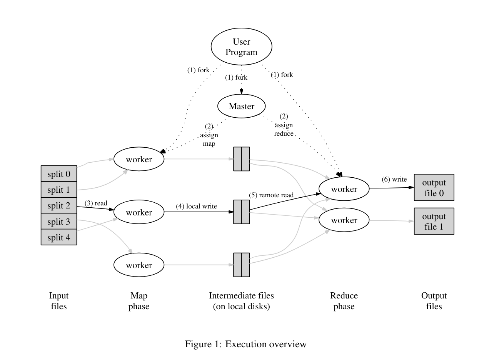



## Lab 1: MapReduce
__Code:__ https://github.com/CIRCIRCIRCLE/Distributed_System-6.824/tree/main/mapreduce   
__Overview:__ This Lab implements a basic MapReduce framework in C++, utilizing condition variables and mutexes for efficient timeout monitoring. Communication between the Master and Workers is achieved through RPC connections.

### Implementation Mechanism of Map and Reduce
<figure style="text-align:center; ">
  
  <figcaption>(Execution of MapReduce image source: Hu et al.)</figcaption>
</figure>

1. Map Function:    
__Objective:__ Split the contents of the input file into key-value pairs.   
__Implementation:__ Read the input file content and split it into words, each word being a key with the value set to "1".   
__Process:__   Read the file content into a string -> Split the string into words, generating a series of key-value pairs (each word corresponds to a key-value pair, with the value being "1") -> Return the list of key-value pairs.

2. Reduce Function:   
__Objective:__ Aggregate intermediate results and calculate the total count for each key (word).   
__Implementation:__ Read intermediate result files and aggregate the values of the same key.    
__Process:__
    - Shuffle Function: Read all intermediate result files and aggregate the values of the same key.
    - ReduceF Function: Calculate the total value for each key and output the final result.

### Mechanism of Timing and Timeout Retransmission
1. __Start Timer When Assigning Tasks:__ Start a timer thread to monitor task completion each time a task is assigned.
2. __Timer Thread Waits for Timeout:__ Use pthread_cond_timedwait() to wait for a specified time. If the task is not completed before the timeout, continue waiting.
3. __Cancel Timer Before Task Completion:__ When the task is completed, the Worker notifies the Master to cancel the timer.
4. __Reschedule Task on Timeout:__ If the task is not completed before the timeout, the Master marks the task as timed out and reschedules it.     
__Notes:__ `pthread_cond_timedwait()` uses operating system-provided synchronization primitives, allowing efficient waiting for events or timeouts without consuming CPU resources. During the wait, the thread yields the CPU, allowing other threads to run, thereby improving the overall system efficiency. Compared to busy-waiting with the sleep() function, pthread_cond_timedwait() effectively avoids wasting CPU resources.   

### RPC Principles
1. ButtonRPC Library:
    - ButtonRPC is a lightweight RPC framework used for remote procedure calls.   
    - It allows communication between the Master and Workers to assign tasks and report status.   
2. RPC Call Process:
    - The Master acts as an RPC server, defining and binding various RPC interfaces, such as task assignment and status updates.
    - Workers act as RPC clients, connecting to the Master and calling these interfaces to obtain tasks or report task completion.
    - Using the concise API of the ButtonRPC library for network communication and data transfer enables efficient collaboration between the Master and Workers.