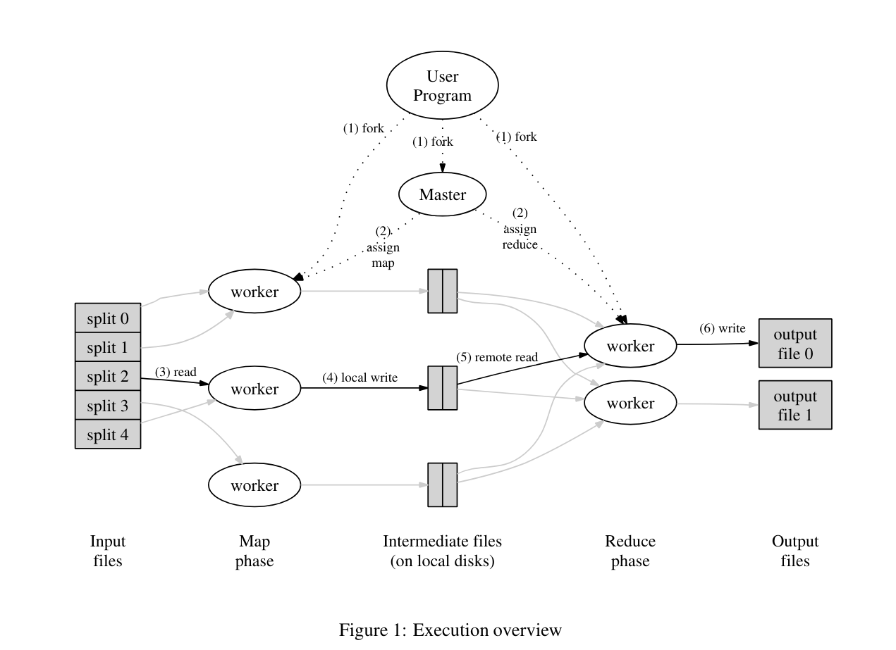
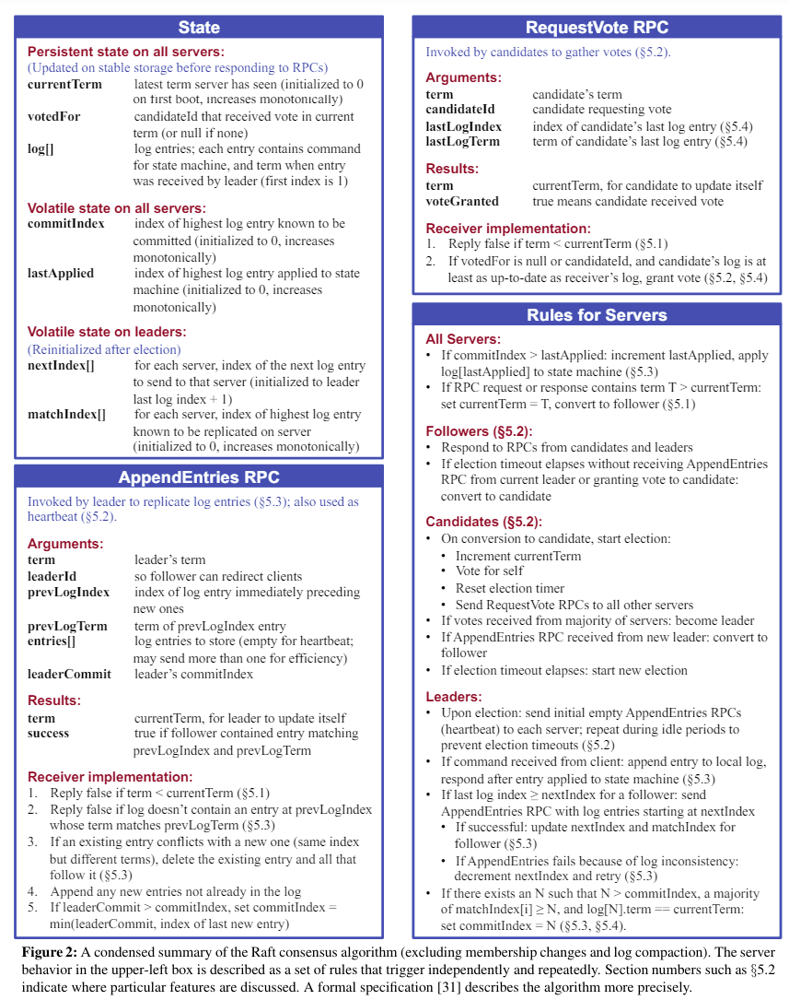

__Code:__ https://github.com/CIRCIRCIRCLE/Distributed_System-6.824

## Lab 1: MapReduce
__基本概述:__ 该Lab基于C++实现了基本的MapReduce框架，使用条件变量与互斥锁实现了高效的超时监控机制，通过RPC连接实现了Master与Worker之间的通信。
### Map和Reduce的实现机制
<figure style="text-align:center; ">
  
  <figcaption>Execution of MapReduce (Image source: Hu et al.)</figcaption>
</figure>

1. Map函数:   
目的: 将输入文件内容拆分成键值对。    
实现: 读取输入文件内容，将其拆分成单词，每个单词作为键，值设为"1"。   
过程:
读取文件内容到一个字符串中 ->  将字符串按单词拆分，生成一系列键值对（每个单词对应一个键值对，值为"1"）-> 返回键值对列表。   

2. Reduce函数:   
目的: 对中间结果进行聚合，计算每个键（单词）出现的总次数。  
实现: 读取中间结果文件，聚合相同键的值。  
过程:
    - Shuffle函数: 读取所有中间结果文件，将相同键的值聚合在一起。
    - ReduceF函数: 计算每个键的总值，并输出最终结果。

### 定时与超时重传的机制
1. 任务分配时启动计时器:每次分配任务时启动一个计时器线程，监控任务的完成情况。
2. 计时器线程等待超时: 使用 pthread_cond_timedwait() 等待指定时间，如果在超时前任务未完成，则继续等待。
3. 任务完成前取消计时器: 任务完成时，Worker会通知Master取消计时器。
4. 任务超时重新分配: 如果任务在超时前未完成，Master会将任务标记为超时并重新分配。    
__Notes:__ pthread_cond_timedwait() 使用操作系统提供的同步原语，可以更高效地等待事件发生或超时，不会占用CPU资源。在等待期间，线程会让出CPU，让其他线程运行，提高系统的整体效率。相比使用 sleep() 函数的忙等待，pthread_cond_timedwait() 可以有效避免CPU资源的浪费。

### RPC原理
1. ButtonRPC库:
    - ButtonRPC是一个轻量级的RPC框架，用于实现远程过程调用。
    - 它允许Master和Worker之间进行通信，以分配任务和报告状态。
2. RPC调用过程:
    - Master作为RPC服务器，定义并绑定各类RPC接口，例如分配任务、更新任务状态等。 
    - Worker作为RPC客户端，连接到Master并调用这些接口获取任务或报告任务完成情况。
    - 使用ButtonRPC库的简洁API进行网络通信和数据传输，使得Master和Worker能够高效地协同工作。

## Lab2: RAFT
__基本概述：__ Raft是一种用于实现分布式一致性的一致性算法，它的目标是使多个节点在分布式系统中达成一致。主要功能包含Leader Election, Log Entries Append, Raft State Persistence.

### 分布式共识算法总结
__可视化网站：__ https://raft.github.io/
<figure style="text-align:center; ">
  
  <figcaption>Summary of Raft Consensus Algorithm</figcaption>
</figure>

### 基本概念
1. 节点状态     
领导者（Leader）：处理客户端请求并管理日志复制。   
候选者（Candidate）：在领导者选举期间尝试成为领导者的节点。   
跟随者（Follower）：被动接收和应用领导者的指令。   

2. 数据结构   
LogEntry：表示日志条目，包含命令和任期号。   
Persister：持久化存储类，用于保存日志和状态。   
AppendEntriesArgs 和 AppendEntriesReply：日志复制请求和响应的参数类。   
RequestVoteArgs 和 RequestVoteReply：投票请求和响应的参数类。   

3. 并发控制   
locker：互斥锁类，用于保护共享数据。     
cond：条件变量类，用于线程间的同步。   

### Raft核心部分实现
#### Leader Election 领导者选举
领导者选举是Raft集群中的节点从自身中选出领导者的过程。领导者负责处理所有客户端请求并协调日志条目向其他节点（追随者）的复制。领导者选举的步骤包括：

- 候选人声明：节点从追随者转换为候选人并增加其任期。
- 请求投票：候选人向其他节点发送投票请求。
- 多数投票：如果候选人获得多数节点的投票，它将成为领导者。
- 任期调整：如果节点收到更高任期的请求，它将更新其任期并成为追随者。
#### Log Entries Append 日志复制
日志条目追加是指从领导者向追随者复制日志条目的过程，以确保集群的一致性。关键步骤包括：

- 领导者接收命令：领导者从客户端接收命令。
- 日志条目创建：领导者创建新的日志条目并将其添加到自身日志中。
- AppendEntries RPC：领导者向追随者发送AppendEntries RPC以复制日志条目。
- 日志一致性检查：追随者检查日志条目在索引和任期上是否与之前的日志条目匹配。
- 确认和提交：一旦大多数追随者追加了该日志条目，领导者提交该条目并将其应用到状态机，通知追随者也这样做。
#### State Persistence 状态持久化
状态持久化是Raft节点保存其状态到稳定存储以在崩溃和重启后生存的机制。这包括当前任期、投票给谁（在当前任期内获得该节点投票的候选人）和日志条目。关键方面包括：

- 序列化：将内存中的状态转换为适合存储的格式。
- 写入稳定存储：将序列化的状态保存到磁盘。
- 反序列化：从磁盘中读取状态并将其加载回内存。
- 一致的状态更新：确保状态更新（如当前任期的变化或新日志条目）在持久化存储中一致反映。
