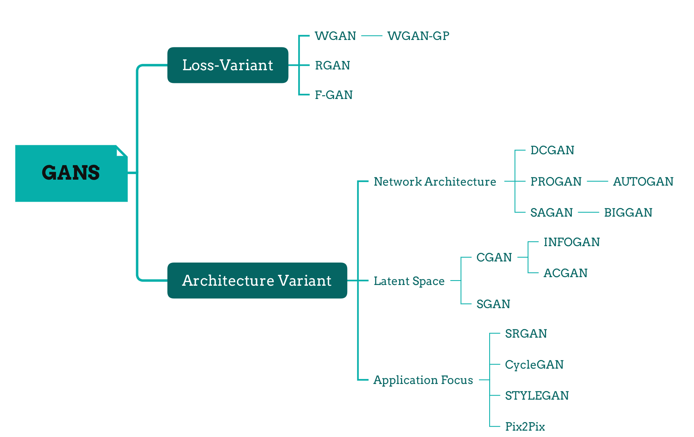
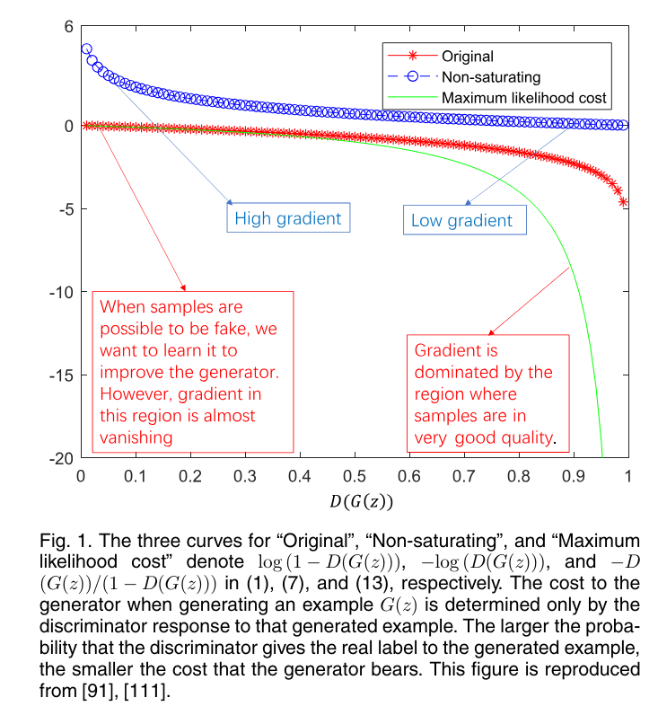
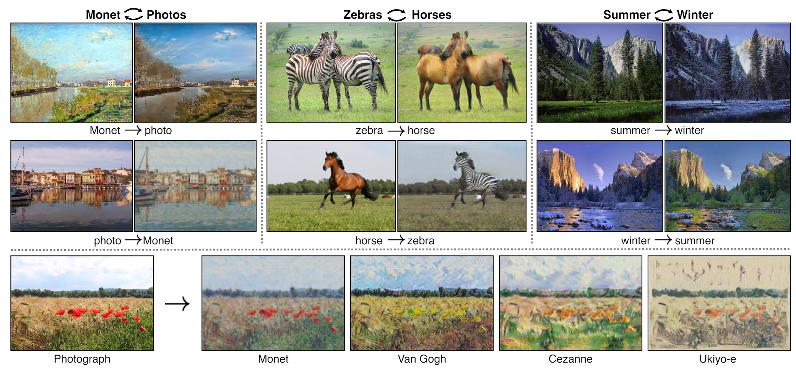
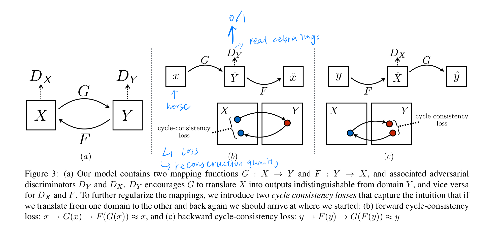
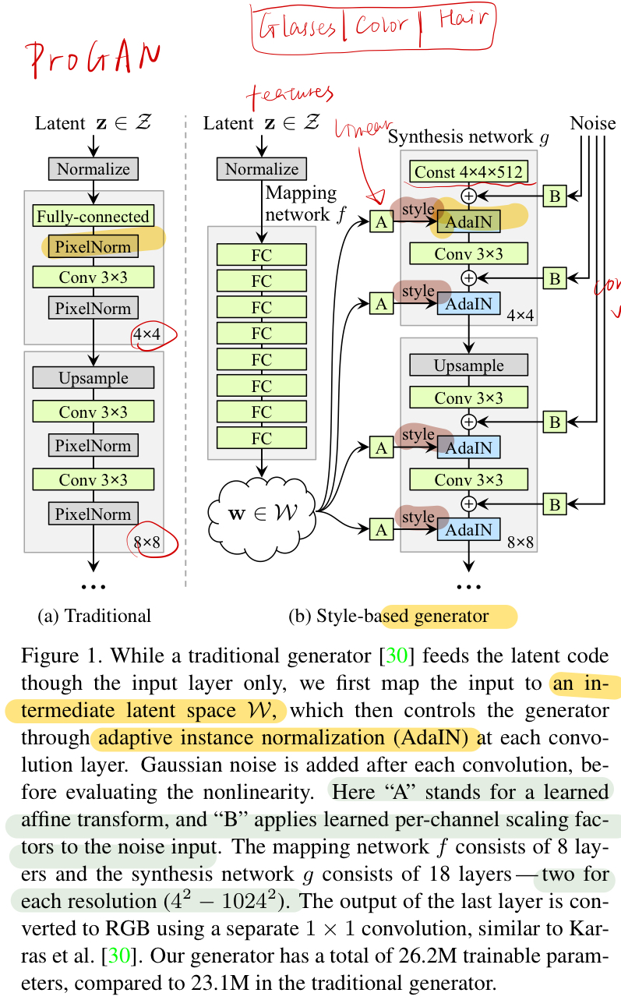
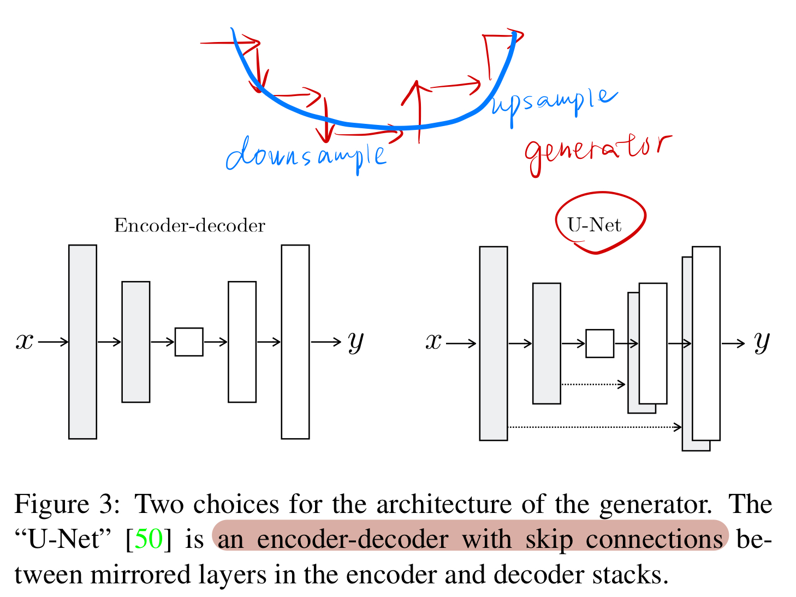
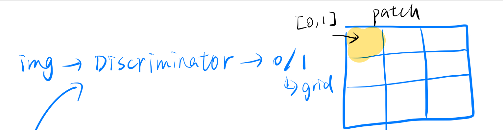


# GANs  
Overview  

__outer resources:__   
- The-gan-zoo: https://github.com/hindupuravinash/the-gan-zoo?tab=readme-ov-file
- Tips to make GAN works: https://github.com/soumith/ganhacks?tab=readme-ov-file
- Survey of GANs: https://iopscience.iop.org/article/10.1088/2632-2153/ad1f77/meta#mlstad1f77s4
- Famous architecture reproduction: https://github.com/aladdinpersson/Machine-Learning-Collection 
- Visualization Tool: GAN Lab
  
## Original GAN    
\\(L_{Discriminator} = \nabla_{\theta_d}\frac{1}{m}\displaystyle\sum_{i=1}^{m}[\log{D(x^{(i)})} + \log{(1-{D(G(z^{(i)}))})}]\\)   
\\(L_{Generator} = \nabla_{\theta_g}\frac{1}{m}\displaystyle\sum_{i=1}^{m}\log{(1-{D(G(z^{(i)}))})}\\)    

### Objective Function:
The goal is to maximize the loss of \\(D\\) and minimize the loss of \\(G\\)
1. Original minmax(zero-sum)   
    \begin{align}
    \displaystyle\min_G \displaystyle\max_D {V(D,G)} &= 
    E_{x\thicksim{p_{data}(x)}}[\log{D(x)}] + E_{z\thicksim{p_z(z)}}[\log{(1-D(G(z)))}] 
    \end{align} 

    Which can also be represented in JS divergence format:  
    \begin{align}
    C(G) = 2JS(p_{data}\parallel p_g)-2\log2
    \end{align}
        not provide a sufficient gradient for G to learn well

2. Non-saturating   
The non-saturating function results in a larger gradients in early learning process.    
\begin{align}
E_{x\thicksim{p_g(x)}}[\-log{D_G^*(x)}] + E_{x\thicksim{p_g(x)}}[\log{(1-D_G^\*(x))}] = KL(p_g\parallel p_{data})
\end{align}

    Mode collapse: G will prefer to produce repititions but safe examples.

3. Miximum Likelihood  
Under the assumption that the discriminator is optimal, minimizing:  
\begin{alignat}{2}
    J^{(G)} &= E_{z\thicksim p_z(z)}[-exp(\sigma^{-1}(D(G(z))))]\\
    &= E_{z\thicksim p_z(z)}[\frac {-D(G(z))} {1-D(G(z))}]
\end{alignat}  
       

## Loss Variant
1. __WGAN -Wasserstein GANs__
    - use the Wasserstein distance as the optimization criterion
    - __objective function:__  \\(W(p_{data},p_g) = \displaystyle\inf_{\gamma \in \prod(p_{data},p_g)}E_{(x,y)\in\gamma}[\parallel x-y\parallel]\\)  where  \\(\prod(p_{data}, p_g)\\) denotes the set of all joint distributions \\(\gamma(x,y)\\) whose marginals are \\(p_{data}\\) and \\(p_g\\)
    - __innovation:__  
        the distence moving from real data and generated data    
        binary classifier --> regression task   
    - __key features:__   
        remove the last sigmoid activation layer      
        remove 'log' function in the loss       
        `weight clipping:`enforce the discriminator to be a 1-Lipschitz function by clipping its weight to a fxed range.   
        replace momentum based optimizer 'Adam' with RMSProp or SGD   

2. __WGAN-GP -Wasserstein GANs -Gradient norm penalty__  
    - use a gradient penalty to achieve Lipschitz continuity.  
    - __Objective Function:__  \\(L = -E_{x\thicksim p_{data}}[D(x)]+E_{\tilde{x}\thicksim p_g}[D(\tilde{x})] + \lambda E_{\tilde{x}\thicksim p_{\tilde{x}}}[(\parallel\nabla_{\tilde{x}}D(\tilde{x})\parallel_2-1)^2]\\)   The last one is the added penalty item.    
    - __Innovation:__  This penalty encourages the gradients of the critic with respect to its inputs to have a norm of 1, which helps stabilize the training process and prevent mode collapse.

3. __RGAN -Relativisitic GANs:__  
    - The idea is to endow GANs with the property that the probability of real data being real \\(D(x_r)\\) should decrease as the probability of fake data being real \\(D(x_f)\\) increases   
    - __Objective Function:__ \\(D(\tilde{x}) = \sigma(C(x_r)-C(x_g))\\)   
    - __Innovation:__ make the output of D depend on both real and generated examples
    - __Key features:__    
        - provide continuous measure of the quality of the generated data, by using the relativistic discriminator as the loss function   
        - improve the stability and robustness of the training process, by avoiding the problems of vanishing gradients, mode collapse, and non-convergence       
  
4. __F-GAN -f-divergences__   
    - Use a general class of divergence functions as the optimization criterion.   
    - __Innovation:__ provide a unified framework for different GAN variants comparision GAN, WGAN, LSGAN and so on by showing equivalence to different f-divergences.   
    - __Key features:__   
        - can use any f-divergence: KL-divergence, JS-divergence, Total Variation Distance and so on.   
        - improve the quality and diversity of the generated data by choosing the appropriate f-divergence that _suits the data characteristics and the model objectives_  

## Architecture Variant 
### Network Architecture  
Original GANs use multi-layer perceptrons(MLPs), so only for small datasets.  
1. __DCGAN -deep convolutional generative adversarial networks__
    - __innovation:__ G and D are defined by deep convolutional neural networks(DCNNs)
    - __key features:__   
        all-convolution net;   
        batch normaliztion except the last layer;   
        use Adam optimizer instead of SGD   

2. __PROGAN -Progressive Growing of GANs__
    -  The idea is to grow both the generator and discriminator progressively: starting from a low resolution, we add new layers that model increasingly fine details as training progresses.
    - __innovation:__ progressively growing training approach
    - __key features:__   
        Gradually increasing the resolution     
        Minibatch Discrimination    
        Pixel-wise normalization, spectral normalization     
        orthogonal regularization  
        

3. __SAGAN: self-attention GAN__   
    - SAGAN stands for Self-Attention Generative Adversarial Network, which is a variant of GANs that uses self-attention mechanism to capture long-range dependencies in images and generate high-quality and high-resolution samples.
    - __innovation:__ Self-attention mechanism
    - __key features:__  
        spectral normalization: improves diversity  
        orthogonal regularization: stability  
        conditional batch normalization: adjust the style and features

### Latent Space
1. __CGAN -Conditional GANs__
    - D and G are conditioned on extra information y:  \\(\displaystyle\min_G \displaystyle\max_D V(D,G)\\) 
        \\(= E_{x\thicksim{p_{data}(x)}}[\log{D(x\|y)}] + E_{z\thicksim{p_z(z)}}[\log{(1-D(G(z\|y)))}]\\) 
    - __innovation:__ G and D need to match a given condition
    - __key features:__    
        generate data matches a given condition     
        learn a conditional distribution, more informative and useful   
        can apply to various types of tasks

     

2. __INFOGAN - information maximizing GAN__   
    - \\( \displaystyle\min_G \displaystyle\max_D V_I(D,G) = V(D,G) -\lambda I(c;G(z,c))\\), G(z,c) is the generated example, I is the mutual infomation. Maximizeing I maximizes the mutual information between c and G, causing c to contain as many important and meaningful features of the real examples as possible.
    - __innovation:__  latent factors  
    - __key features:__  
        Unsuperviesed manner   
        Discover and munipulate latent factors of semantic attributes      
        lower bound to approximate \\(P(c\|x)\\)

3. __ACGAN -Auxiliary Classifier GANs__
    - incorporate a classifier as part of the discriminator, produce recogmozable examples
    - __Objective functions:__   
        The log-likelihood of the correct source \\(L_s\\) and correct class \\(L_c\\), the aim is to maximize \\(L_c+L_s\\) and \\(L_c-L_s\\)   
        \\(L_s = E[\log P(S=real\|X_{real})] + E[\log P(S=fake\|X_{fake})]\\)   
        \\(L_c = E[\log P(C=c\|X_{real})] + E[\log P(C=c\|X_{fake})]\\)    
    __innovation:__ generate data matches the given class label     
    __key features:__      
        add conditional information y into the discriminator   
        learn conditional distribution of the data    
        leverage the supervised infomation from the class labels and unsupervised information from the GAN object   

        
4. __SGAN -Stacked GAN__   
    - use a top-down stack of GANs to generate data from hierarchical representations   
    - __innovation:__   progressively adding finer details at each layer of the stack   
    - __key features:__  
        capture different levels of abstraction and variation(more diverse representation)   
        can leverage the pre-trained discriminative network(VGG, ResNet) without additional supervision     

### Application Focus
1. __SRGAN -Super-Resolution__    
    - use a perceptual loss function to generate high-resolution images from low-resolution images  
    - __innovation:__ upscaling factors to infer photo-realistic natural images
    - __key features:__ 
        - The perceptual loss function consists of an adversarial loss and a content loss, based on the pre-trained VGG network.  
        - capture the fine textures and details of the natural images
        - upscaling: use a deep residual network with skip connections and sub-pixel convolution layers
    - __further improvement:__
        ESRGAN(Enhanced SRGAN)  
        cycle-in-cycle GANs(unsupervised image SR)   
        SRDGAN(learn noise)  
        TGAN(explore tensor structure) 

2. __CycleGAN__   
    - image-to-image translation between unpaired domains  
    
    - __innovation:__  Use a cycle consistency loss that enforces the generator to reconstruct the original img from the translated img.  
    - __key features:__  
    
        - no paired examples needed
        - preserve the key attributes and structures of the input imgs
        - learn a mapping function that is bijective and invertible
    - __application:__ 
        - Style Transfer, object transfiguration, photo enhancement   

3. __StyleGAN__  
    - use adaptive instance normalization to control the style and features of the generated images at different scales  
    - __innovation:__  learn an unsupervised separation of high-level attributes    
    - __key features:__  
        - It can enable intuitive and scale-specific control of the synthesis, by manipulating the style vectors that correspond to different levels of detail.  
        - add noise makes it more detailed
    
     
4. __Pix2Pix__    
    - use a conditional GAN objective combined with a reconstruction loss, which are based on the features extracted by a pre-trained VGG network.   
    - __innovation:__  translate images from one domain to another using paired examples like edges or maps    
    - __key features:__    
        - preserve the key attributes and structures of the input images   
        - use a U-Net-Based generator with skip connections 
            
        - use a patchGAN-based discriminator  
            
    - __applications:__  
        - style transfer, object transfiguration, photo enhancement, and more   

