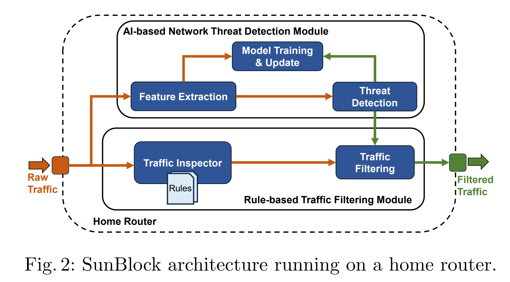



## 1. Information Exposure From Consumer IoT Devices
**Objectives:**  
 The objective of the paper is to systematically measure and analyze the extent of information exposure from consumer IoT devices, considering the heterogeneity in devices’ interfaces, protocols, and functionalities. 
 
 The paper considers multiple indices such as the types of data transmitted, the use of encryption, the identification of first, support, and third parties involved in data transmission, and regional differences in compliance with privacy regulations.

__Index:__  IoT security, Network Measurement, Encryption, Inferred user interactions 

**Methods:**     
The research employs a mixed-method approach, combining 34,586 automated and manual experiments to capture and analyze network traffic generated by these IoT devices.   

The framework is designed to capture data flows, analyze traffic patterns, and identify information exposures under different encryption scenarios. This includes controlled experiments to determine how and where data is sent, and whether there are any unexpected transmissions of private information. The study also compares results between the US and UK, considering potential regulatory impacts on data transmission practices.

**Main Context:**
1. Network destinations: Where the data from these devices is sent.  
2. Encryption status: Whether the data transmitted is encrypted.  
3. Inferred user interactions: What user behaviors can be inferred from the data, even if encrypted.  

**Outcomes:**   
The study found significant information exposure across the devices tested. Many devices sent data to a large number of third-party servers, and while some communications were encrypted, many devices still transmitted sensitive information in ways that could potentially be exploited. There were also noticeable differences in data transmission behaviors between the US and UK, which may be influenced by differing privacy laws.

**Contribution:**  
This research provides a comprehensive, multidimensional view of the privacy risks associated with IoT devices. It highlights the need for better privacy protections and transparency in how these devices handle user data. The findings also suggest the importance of regulatory measures in shaping how IoT devices interact with user data.

## 2. SunBlock: Cloudless Protection for IoT Systems
**Objectives:**  
The main goal is to develop a system that combines machine learning (ML) and rule-based traffic filtering to detect and prevent IoT threats locally, without needing to send data to the cloud. This addresses concerns about privacy and latency associated with cloud-based IoT protection solutions.

__Index:__  Internet of Things (IoT); IDS and IPS; Security and Privacy; Cloudless Solutions    

**Methods:**   

1. Implemented on a mid-range home router
2. Leveraging a rule-based Intrusion Detection and Prevention System (IDS/IPS), along with an AI-based threat detection model adapted for the limited resources of home routers. 
3. The AI component employs the One-Class Support Vector Machine (OCSVM) model to detect anomalies in network traffic, allowing the system to identify and block potential threats in real-time.

**Results:**   
1. Threats including anomalous traffic and upload, Flooding, Scanning, PII Leakage are operated through raspberry Pi.
2. Utilization of hardware is tested
3. Compared with existing IoT solutions

**Contribution:**   
Demonstrating the feasibility of a cloudless, local IoT security solution that maintains user privacy while providing robust threat detection and prevention. This approach reduces the dependency on external cloud services, thereby limiting potential data exposure and enhancing the overall security of IoT systems.

This research presents a significant step forward in IoT security, particularly for users concerned about privacy and the limitations of cloud-based security solutions.

## 3. In-Vehicle Communication Cyber Security: Challenges and Solutions
**Objectives:**

The paper aims to investigate and address the cybersecurity challenges in modern in-vehicle communication systems. With the increasing integration of communication and computing devices in vehicles, there is a growing need to secure these systems against potential cyber threats. The paper focuses on evaluating existing security techniques and proposes a comprehensive, multi-layer secure framework to enhance the cybersecurity of in-vehicle networks.

__Index:__ Security, IDS, In-vehicle Network

**Methods:**   
The research uses a critical review approach to analyze the existing literature and technologies related to in-vehicle communication cybersecurity. It assesses the effectiveness of current solutions and proposes a new multi-layer secure framework designed to be independent of specific protocols or use cases.

**Main Context:**
1. In-Vehicle Communication Architecture: The study details the technical architecture of in-vehicle communication systems, including components, interfaces, and technologies used in modern vehicles.   

2. Protocol Classification: It classifies various communication protocols used in vehicles based on their characteristics and applications, identifying key vulnerabilities in these protocols.  

3. Security Challenges: The paper discusses the specific cybersecurity threats faced by in-vehicle communication systems, such as the lack of encryption and authentication in existing protocols like CAN (Controller Area Network).  

4. Proposed Solutions: It reviews current security solutions, including machine learning-based intrusion detection, cryptographic techniques, and port-centric methods.  

**Outcomes:**
The paper identifies significant vulnerabilities in the current in-vehicle communication protocols, which make them susceptible to various cyber-attacks. The proposed multi-layer security framework effectively addresses these vulnerabilities by integrating multiple security measures, including advanced machine learning techniques for real-time intrusion detection.

**Contribution:**
1. Framework Development: One of the key contributions is the development of a protocol-independent multi-layer security framework for in-vehicle communication systems.

2. Comprehensive Analysis: The paper provides a thorough analysis of existing security techniques and their limitations, contributing to the broader understanding of in-vehicle cybersecurity.

3. Future Research Directions: It highlights open challenges and suggests areas for future research, emphasizing the need for continuous updates and improvements in in-vehicle cybersecurity measures.
