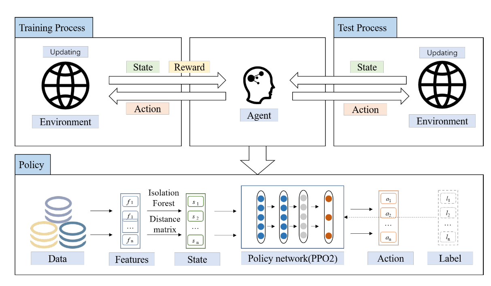



## 1. A Systematic Review of Data-Driven Attack Detection Trends in IoT

## 2. CICIoT2023: A Real-Time Dataset and Benchmark for Large-Scale Attacks in IoT Environment
**Objectives:**  
The main goal of this research is to propose a novel and extensive IoT attack dataset to foster the development of security analytics applications in real IoT operations. 

To accomplish this, 33 attacks are executed in an IoT topology composed of 105 devices. These attacks are classified into
seven categories, namely DDoS, DoS, Recon, Web-based, brute force, spoofing, and Mirai. Finally, all attacks are executed by malicious IoT devices targeting other IoT devices.  

__Index:__  Internet of Things (IoT); dataset; security; machine learning; deep learning; DoS; DDoS; reconnaissance; web attacks; brute force; spoofing; Mirai

**Methods:**   

**Main Context:**

**Outcomes:**

**Contribution:**

## 3. Reinforcement learning meets network intrusion detection: a transferable and adaptable framework for anomaly behavior identification
**Objectives:**

Most anomaly detection model must train the entire data set at an immense cost. We propose a transferable and adaptable network intrusion detection system(TA-NIDS) based on deep reinforcement learning.

__Index:__ Deep reinforcement learning, anomaly detection, transferable framework, robustness, adaptable framework

**Methods:**   

1. Basic RL: The agent obtains knowledge from the environment and improves the action plan to adapt to the environment. Positive reward is regarded as the reinforcement signal, try to maximize the expectation of reward R_t. 
2. Reward machanism for interactive processes: set the positive reward that can be obtained only when outlier classes are screened correctly. Prioritize selecting outliers by reward mechanism, making it adaptable to the actual scene.
3. Proximal policy optimization(PPO): PPO uses constraints to ensure that the difference between the old and new strategies is not too significant, which can avoid unexpected performance degradation caused by significant differences.

**Main Context:**
1. prioritize key categories: a large data set may only have a few outliers. Apparent outliers must be selected first.
2. Interaction between agent and environment: RL obtains valuable information with the reward through continuous interaction.
3. Identify a general data format: which can calculate the features of different data sets
4. Detailed design: Enviroment, State, Action, Reward, Policy

**Outcomes:**
- Datasets：
|Dataset|Attributes|attacks|
|---|---|---|
|IDS2017|Contain benign and common attacks|brute force FTP, SSH, DOS, Heartbleed, Web attack, Intrusion, Botnet, and DDoS|
|IDS2018|network traffic and system logs|brute force, Heartbleed, Botnet, DOS, DDoS, Web|
|NSL-KDD|||
|UNSW-NB15|comprehensive network attack traffic dataset|49 features and 9 attacks. Fuzzers, Analysis, Backdoors,DOS, Exploits, Generic, Reconnaissance, Shellcode, and worms
|CIC-IoT|ioT network traffic dataset|seven categories: DDoS, DoS, Recon, Web-based, Brute Force, Spoofing, and Mirai|
- Experiments on data sets including binary classification, multiple classifications and transferable results.

**Contribution:**
1. Propose a framework for anomaly detection with adaptability and transferability based on deep reinforecement learning(DRL).
2. Transferability: Unify the features of the data set into the states observed from the environment. No requirements for feature dimensions, no need to adjust parameters.
3. Adaptability and robustness: Design a reward mechanism to allow the agent to preferentially select ouliers, prioritizing the selection of outliers improves detection efficiency. 
4. Designed an enviroment that adjusts based on the identification action, and the states can be calculated using input network traffic, where transforming the traffic characteristics into the state in the environment. The environment has interaction with the agent, changes in real time.
5. Conduct extensive experiments in IDS2017, IDS2018, NSL-KDD,UNSW-NB15, CIC-IoT2023
6. TA-NIDS suits the following scenarios related to network security management: 
    - Scenes where noticeable abnormalities must be detected first. 
    - Scenes in which the natural environment changes in real time. 
    - Transfer the results of one data set directly to other data sets.
