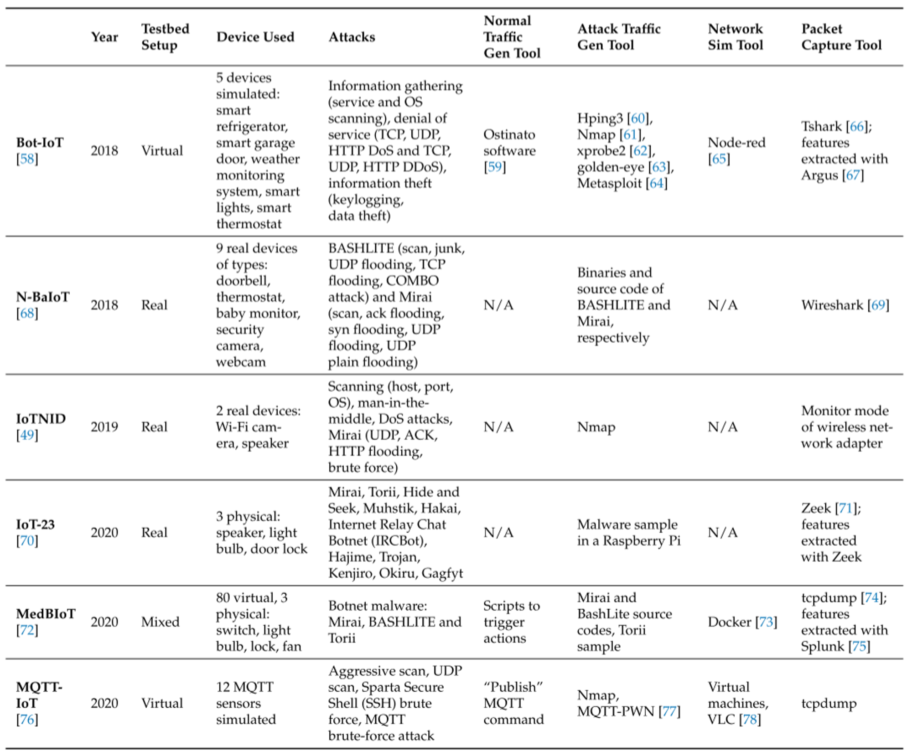
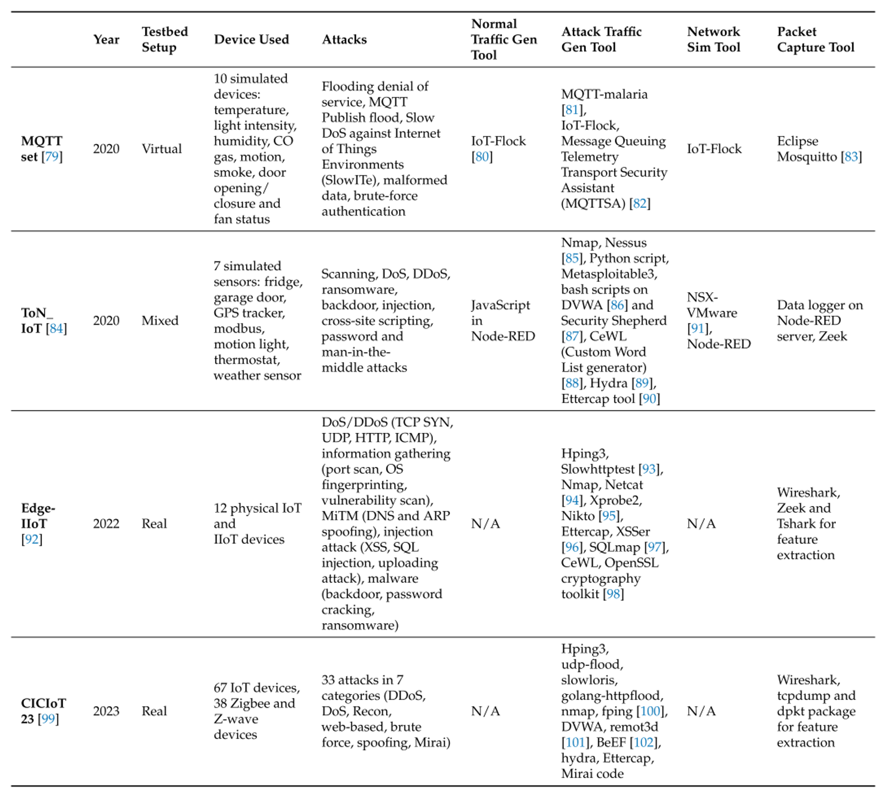



## 1. A Systematic Review of Data-Driven Attack Detection Trends in IoT
**Objectives:**  
 This research aims to provide an overview of the IoT datasets available today, trends in machine learning and deep learning usage, and the efficiencies of these algorithms on a variety of relevant datasets. The results of this comprehensive survey can serve as a guide and resource for identifying the various datasets, experiments carried out and future research directions in this field.

__Index:__  IoT; datasets; machine learning; cyberattack; intrusion detection; threat detection

**Methods:**     
1. Define the research questions (RQs) the review addresses.
2. Outline the information sources used to retrieve relevant information.
3. Determine the keywords used to perform search queries in the databases.
4. Filter of information based on inclusion and exclusion criteria.
5. Representation of the results found in relation to the research questions defined

**Main Context:**
1. iot architecture and threat mapping

mindmap
  root((IoT Architecture))
    A[Layer Specific]
        Physical
        Network
        Middleware
        Application
    Domain Specific
      Cloud IoT
      IIoT
      Smart Cities
    Industriy Specific
        Smart things
        Cisco
        AWS


2. Datasets and corresponding networks

3. Dataset Features:  
3 features are mainly used for tagging benign, attack and type of attack: __attack, category and subcategory labels__  
_e.g. the category is used to indicate that a flow belongs to a DoS attack while the subcategory indicates if it was a UDP, TCP, HTTP or ICMP DoS attack_

4. Attack category:  
    **OSI mapping:**
    |Layer|Attack|
    |---|---|
    |application|XSS, SQL injection, HTTP DoS|
    |transport|TCP, UDP, DDoS, DoS|
    |Network|ICMP flood, DoS|
    |Datalink|ARP Spoofing|

    **Traffic Related:**
        Mirai and BASHLITE are the most common types
        DoS and reconnaissance attacks are the next most common  
    **IoT protocols related:** MQTT attacks

5. ML and DL tools:   
    It was also observed that the most commonly used ML algorithms were tree-based, while neural networks (NNs) are the most common for DL algorithms.  
      
    Federated Learning: data from iot are non-IID, device could train the model at different times with different data sizes or parameters. This is a huge advantage, as IoT sensors differ in terms of their characteristics and the amount of information they gather.  

**Outcomes:**   
feature engineering, IoT protocols, system requirements and efficiencies of detection models   

**Contribution:**  
A foundation for understanding the current state and potential trajectory of data-driven attack detection trends in IoT research. The variations within the range of IoT-related datasets studied demonstrate that momentum is building in this area.

## 2. CICIoT2023: A Real-Time Dataset and Benchmark for Large-Scale Attacks in IoT Environment
**Objectives:**  
The main goal of this research is to propose a novel and extensive IoT attack dataset to foster the development of security analytics applications in real IoT operations. 

To accomplish this, 33 attacks are executed in an IoT topology composed of 105 devices. These attacks are classified into
seven categories, namely DDoS, DoS, Recon, Web-based, brute force, spoofing, and Mirai. Finally, all attacks are executed by malicious IoT devices targeting other IoT devices.  

__Index:__  Internet of Things (IoT); dataset; security; machine learning; deep learning; DoS; DDoS; reconnaissance; web attacks; brute force; spoofing; Mirai

**Methods:**   
IoT topology -> execute attacks -> collect data from benign and malicious scenarios

**Main Context:**
1. Data collection of benign and malicious scenarios:
| |Attack|
|---|---|
|__DDoS__|ACK Fragmentation, UDP Flood, SlowLoris, ICMP Flood, RSTFIN flood, PSHARK flood, HTTP Flood, UDP Fragmentation, ICMP fragmentation, TCP Flood, SYN Flood, SynonymousIP Flood|
|__DoS__|TCP Flood, HTTP Flood, SYN Flood, UDP Flood|
|__Recon__|Ping Sweep, OS Scan, Vulnerability Scan, Host Discovery|
|__Web-Based__|SQL injection, command injection, Backdoor Malware, Uploading Attack, XSS, Browser Hijacking|
|__Brute Force__|Dictionary Brute Force|
|__Spoofing__|ARP Spoofing, DNS Spoofing|
|__Mirai__|GREIP Flood, Greeth Flood, UDPPlain|

2. Gathering info from the iot topology
Ping Sweep, OS Scan, Vulnerability Scan, Port Scan, Host Discovery

3. Evaluation: Logistic Regression, Percepton, AdaBoost, DeepNeuralNetwork, Random Forest

**Outcomes:**   
We evaluate ML performance from three different perspectives:   
1. multiclass classification, focussing on classifying 33 individual attacks;   
2. grouped classification, considering 7 attack groups (e.g., DDoS and DoS);   
3. binary classification (i.e., malicious and benign traffic classification)  

**Contribution:**   
1. Design a new realistic IoT attack dataset, CICIoT2023, using an extensive topology composed of several real IoT devices acting as either attackers or victims;
2. We perform, document, and collect data from 33 attacks divided into 7 classes against ioT devices and demonstrated how they can be reproduced;
3. We evaluate the performance of machine and deep learning algorithms using the CICIoT2023 dataset to classify and detect IoT network traffic as malicious or benign.

## 3. Reinforcement learning meets network intrusion detection: a transferable and adaptable framework for anomaly behavior identification
**Objectives:**

Most anomaly detection model must train the entire data set at an immense cost. We propose a transferable and adaptable network intrusion detection system(TA-NIDS) based on deep reinforcement learning.

__Index:__ Deep reinforcement learning, anomaly detection, transferable framework, robustness, adaptable framework   
__source code:__ https://github.com/HE0413/TA-NIDS.git

**Methods:**   

1. Basic RL: The agent obtains knowledge from the environment and improves the action plan to adapt to the environment. Positive reward is regarded as the reinforcement signal, try to maximize the expectation of reward R_t. 
2. Reward machanism for interactive processes: set the positive reward that can be obtained only when outlier classes are screened correctly. Prioritize selecting outliers by reward mechanism, making it adaptable to the actual scene.
3. Proximal policy optimization(PPO): PPO uses constraints to ensure that the difference between the old and new strategies is not too significant, which can avoid unexpected performance degradation caused by significant differences.

**Main Context:**
1. prioritize key categories: a large data set may only have a few outliers. Apparent outliers must be selected first.
2. Interaction between agent and environment: RL obtains valuable information with the reward through continuous interaction.
3. Identify a general data format: which can calculate the features of different data sets
4. Detailed design: Enviroment, State, Action, Reward, Policy

**Outcomes:**
- Datasets：
|Dataset|Attributes|attacks|
|---|---|---|
|IDS2017|Contain benign and common attacks|brute force FTP, SSH, DOS, Heartbleed, Web attack, Intrusion, Botnet, and DDoS|
|IDS2018|network traffic and system logs|brute force, Heartbleed, Botnet, DOS, DDoS, Web|
|NSL-KDD|||
|UNSW-NB15|comprehensive network attack traffic dataset|49 features and 9 attacks. Fuzzers, Analysis, Backdoors,DOS, Exploits, Generic, Reconnaissance, Shellcode, and worms
|CIC-IoT|ioT network traffic dataset|seven categories: DDoS, DoS, Recon, Web-based, Brute Force, Spoofing, and Mirai|
- Experiments on data sets including binary classification, multiple classifications and transferable results.

**Contribution:**
1. Propose a framework for anomaly detection with adaptability and transferability based on deep reinforecement learning(DRL).
2. Transferability: Unify the features of the data set into the states observed from the environment. No requirements for feature dimensions, no need to adjust parameters.
3. Adaptability and robustness: Design a reward mechanism to allow the agent to preferentially select ouliers, prioritizing the selection of outliers improves detection efficiency. 
4. Designed an enviroment that adjusts based on the identification action, and the states can be calculated using input network traffic, where transforming the traffic characteristics into the state in the environment. The environment has interaction with the agent, changes in real time.
5. Conduct extensive experiments in IDS2017, IDS2018, NSL-KDD,UNSW-NB15, CIC-IoT2023
6. TA-NIDS suits the following scenarios related to network security management: 
    - Scenes where noticeable abnormalities must be detected first. 
    - Scenes in which the natural environment changes in real time. 
    - Transfer the results of one data set directly to other data sets.
