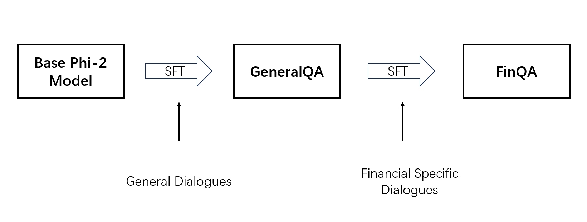
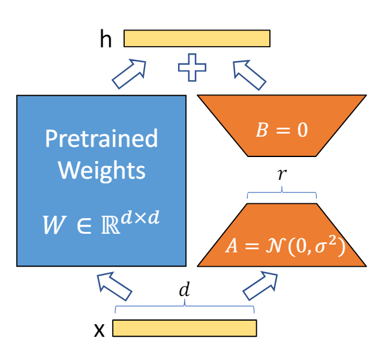
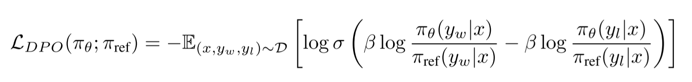
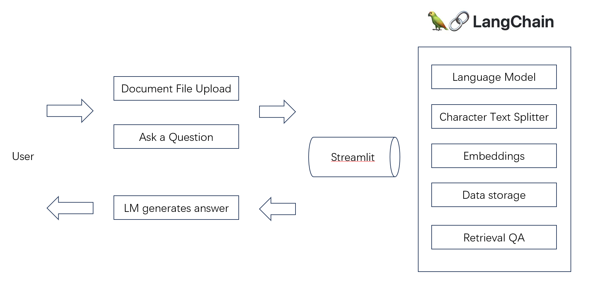
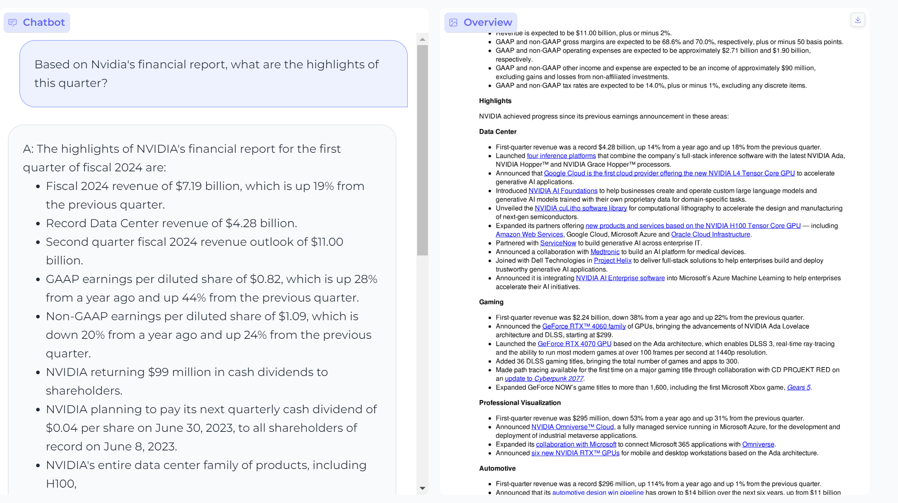



## Description   
This project delves into advancing financial Natural Language Processing (NLP) with the Phi-2 transformer model. It integrates __QLoRA__ (Quantized Low-Rank Adaptation) for efficient fine-tuning and __DPO__ (Direct Preference Optimization) to align model outputs with human preferences. Additionally, enhancements through __RAG__ (Retrieval-Augmented Generation) and Langchain facilitate document-based interactions. The study showcases marked improvements in the processing of financial data, illustrating the transformative potential of these methodologies in the financial NLP landscape.

__Code:__ https://github.com/CIRCIRCIRCLE/DLNLP_24_SN23202440

__Used Methods:__
- __QLoRA:__ For parameter-efficient fine-tuning, maintaining performance while reducing computational demands.
[Paper Link](https://arxiv.org/abs/2305.14314)
- __DPO:__ Aligning model outputs with human preferences to improve relevance and applicability in financial scenarios. [Paper Link](https://arxiv.org/abs/2305.18290)
- __RAG:__ Enhancing document-based interactions through RAG and Langchain, facilitating dynamic responses grounded in financial documents. [paper link](https://arxiv.org/abs/2005.11401)

## Structure of this study
   

The processing pipeline of this study:
- Use QLoRA to fine-tune the model based on some [general QA datasets](https://huggingface.co/datasets/circircircle/generalQA). -> Model: ['GeneralQA-phi2'](https://huggingface.co/circircircle/GeneralQA-phi2)
- Use QLoRA to fine-tune the model based on [financial-specific QA datasets](https://huggingface.co/datasets/circircircle/FinQA). -> Model: ['FinQA-phi2'](https://huggingface.co/circircircle/FinQA-phi2)
- Use DPO optimization to align with human preferences based on [Intel/orca_dpo_pairs](https://huggingface.co/datasets/Intel/orca_dpo_pairs). -> Model:['FinDPO-Phi2'](https://huggingface.co/circircircle/FinDPO-Phi2)
- Use RAG and Langchain to link the optimized model with local documents and do the document-based chat.

Hyperparameters:   
- Supervised Fine-tuning: general QA: rank=32, alpha=64 | FinQA: rank = 256, alpha=64
- DPO: r=16, alpha=32

## Implementation
### Data Preprocessing
For the first two stages of fine-tuning, the data are formatted to include structured prompts, questions, and answers in a specific template. Here is an example format:  

    Below is an instruction that describes a task. Write a response that appropriately completes the request.
    ### Question:
    [Your question here]
    ### Answer:
    [The corresponding answer here]
    ###end

For DPO fine-tuning, the data are formatted to distinguish between preferred and rejected responses, along with the prompts and questions. This format is designed to train the model to align its outputs with human preferences. Here’s how the data are structured:   

    'chosen': '[Preferred text response]',
    'rejected': '[Less preferred text response]',
    'prompt': '[Contextual prompt or instruction]',
    'question': '[Specific question]'

### SFT
Below shows the pipeline of SFT processing:
     
QLoRA optimizes model efficiency by focusing training on a small subset of the base model's parameters and employing a quantized (specifically, 4-bit quantization) version of the model compared to LoRA. This approach reduces computational demands and memory usage while maintaining performance, making it ideal for resource-constrained environments. The principle is shown below:
<figure style="text-align:center; ">
  
  <figcaption>The principle of LoRA achieving efficient fine-tuning: only A and B are trained(image source: Hu et al.)</figcaption>
</figure>

### DPO
To better align with human preferences, DPO is introduced which offers a simpler and more effective means of making LMs more responsive to human preferences. This approach eliminates the need for manual intervention commonly associated with traditional reinforcement learning methods in RLHF. Instead, DPO achieves alignment with human preferences through a policy objective. The equation is illustrated below:
 
The objective is to directly maximize the likelihood of human -preferred answers using the optimal policy \\(\pi_{\Theta}\\). In this equation, σ represents the sigmoid function, β is a scaling factor that adjusts the steepness of the preference curve, (x, \\(y_w\\), \\(y_l\\)) denotes the tuple of input text, winning answer, and losing answer. \\(\pi_{ref}\\) stands for the reference policy which is calculated via a frozen reference model that has the same parameters as the initial LLM sampled from the dataset \\(D\\).   

The predicted probabilities, \\(\pi_{\Theta}(y_w|x)\\) and \\(\pi_{\Theta}(y_l|x)\\), reflect the model’s preference for generating the winning answer \\(y_w\\) over the losing answer \\(y_l\\) given the input \\(x\\). This loss function encourages the model to prefer human selected answers, effectively tuning the model to generate outputs that reflect human preferences.
and preferences.

### RAG with Langchain
The core elements of RAG are __indexing, retrieval and generation__. RAG's output merges the intrinsic knowledge of language models with precise information sourced from specific documents, thereby enriching the language model's responses with both breadth of understanding and depth of detail.     
The pipeline of local document processing is illustrated in the figure below:  
 

## Results
### A. Financial QA Language Model   
more test examples are shown here: [results](https://github.com/CIRCIRCIRCLE/DLNLP_24_SN23202440/blob/main/A_Finetune/results.txt).Comparisons are highlighted using bold text. We can observe the improving expression in changes in intonation, accuracy and coherence of words.   

    Q: What are some signs that the stock market might crash?     

__GeneralQA:__  
Some potential warning signs of an impending stock market crash include a sudden and significant drop in stock prices, increased volatility or uncertainty in financial markets, high levels of investor anxiety or panic selling, negative economic indicators such as rising unemployment rates or falling GDP growth, geopolitical tensions or conflicts between major world powers, and large-scale corporate bankruptcies or defaults. Additionally, there may be other factors at play, including changes to government policies or regulations, shifts in consumer sentiment or spending habits, natural disasters or extreme weather events, or unexpected developments in global trade or supply chains. It is important for investors to stay informed about these various factors and monitor their investments carefully in order to make informed decisions and minimize risk during periods of market instability.

__FinQA:__     
There is __no single sign or indicator of an impending stock market crash__. However, there may be __a combination of factors__ that could suggest increased risk for investors to consider before making investment decisions. These include:
1) High levels of volatility in the markets - if stocks and other securities experience large swings up and down over short periods of time, this can indicate heightened uncertainty about future performance which could lead to further declines.
2) Rising interest rates - when borrowing costs increase (such as through higher yields on bonds), it becomes more expensive for companies to finance their operations and invest capital into growth projects; additionally, rising rates often cause investor sentiment towards equities to become negative due fear associated with potential losses from equity investments during economic downturns caused by tightening credit conditions resulting from tighter monetary policy implemented by central banks like Federal Reserve Bank of United States (Fed).
3) Economic indicators such as GDP growth rate slowing significantly below expectations or unemployment numbers increasing sharply above forecasts would likely signal concerns among economists regarding near-term prospects for global economies including those here at home within North America region where Canada has been experiencing sluggish job creation while U.S. economy continues struggling despite recent upturn seen recently thanks largely due to fiscal stimulus measures taken earlier this year under President Donald Trump's administration.

__FinDPO:__     
There is __no definitive answer to this question as predicting a stock market crash can be difficult__. However, there are __several indicators and warning signs__ that investors often monitor closely for potential downturns in the market. These include:
1) __Rising interest rates__ - When interest rates increase, it generally makes borrowing more expensive which could lead to decreased consumer spending and lower corporate profits. This may cause stocks to decline.
2) __Inflationary pressures__ - High inflation erodes purchasing power over time, leading consumers to spend less money on goods and services. Companies then experience declining sales, causing their share prices to drop.
3) __Economic growth slowdown or recession__ - A slowing economy typically results from decreasing business activity due to factors such as reduced demand, increased unemployment, or falling incomes. As businesses struggle financially, they may cut costs by reducing capital expenditures (investments), laying off employees, or delaying hiring new staff. All of these actions negatively impact company earnings reports and investor confidence, potentially resulting in declines in stock prices.
4) __Political instability__ - Uncertainty surrounding political events or policies can create an unstable environment for investing. 

### B. RAG-Based PDF Chatbot

## Problems
1. `Text generation based on the DPO-optimized model`:
 I asked some questions, most worked well but some had incomplete results, some started with a nonsense new question and answered it repeatedly.  
 _This can be mitigated by setting the generation configurations of temperature, top_k, top_p, max_lengthand repetition penalty. Financial information often requires a high degree of accuracy and professionalism, lower temperature level and balance top k and top p to allow a degree of creativity while limiting content generation that is too off-topic._ 

2. There are also some strange markings like ###endofquestionandanswer*, ##Requirement:, ###endofgeneration|>.   
_This can be mitigated by post process using regularization deletion._  

3. While the summary of the report can be properly generated for the first interaction but the following outputs are not stable. This may be caused by context management issues since the model is originally focused on the QA bot so it does not properly handle and isolate context in successive interactions.    
_Refined dialogue management techniques and distinct context handling for successive interactions is critical._