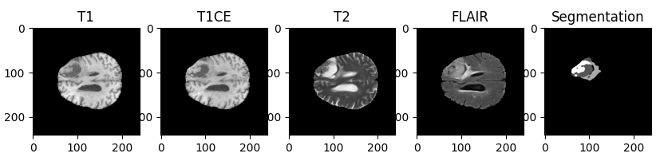
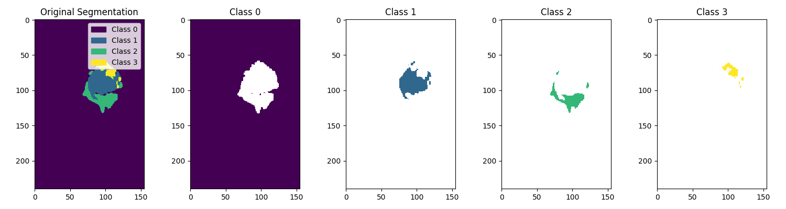
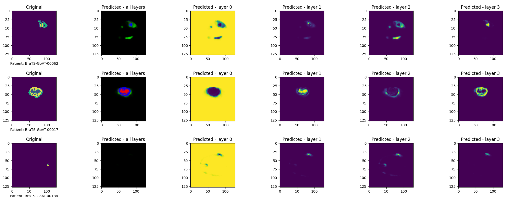
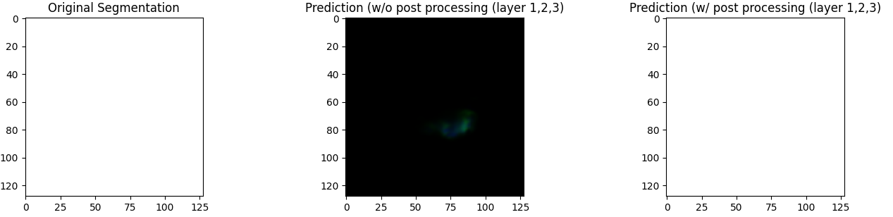
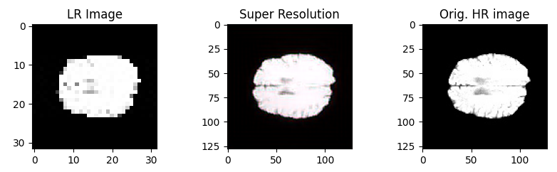
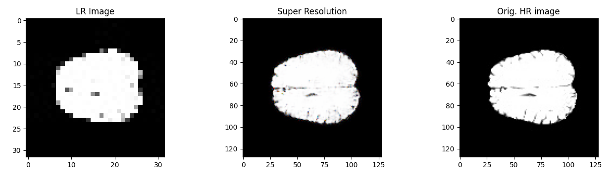
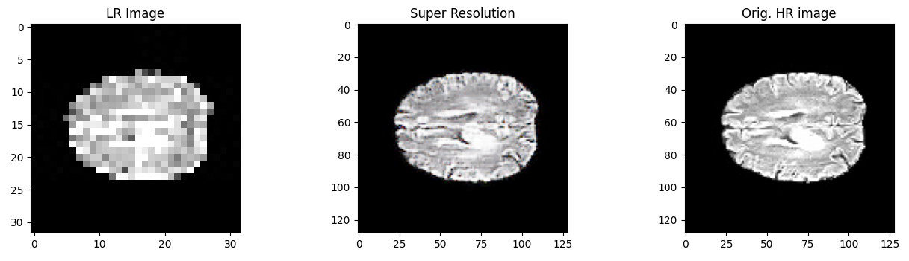

## Description   
This project focuses on brain tumor segmentation and image super-resolution using the BraTS dataset. The tasks are accomplished by implementing U-Net for brain tumor segmentation and utilizing SRGAN (Super-Resolution Generative Adversarial Network) and ESRGAN (Enhanced Super-Resolution Generative Adversarial Networks) for image super-resolution from 28x28 to 128x128 pixels.

__Code:__ https://github.com/CIRCIRCIRCLE/AMLS_II_assignment23_24

__Used Methods:__
- **U-Net**: Convolutional Networks for Biomedical Image Segmentation. [Paper Link](https://arxiv.org/abs/1505.04597)
- **SRGAN**: Photo-Realistic Single Image Super-Resolution Using a Generative Adversarial Network. [Paper Link](https://arxiv.org/abs/1609.04802)
- **ESRGAN**: Enhanced Super-Resolution Generative Adversarial Networks. [Paper Link](https://arxiv.org/abs/1809.00219)

__Dataset:__  
The dataset used in this project is the __BraTS-ISBI 2024 - Generalizability Across Tumors Challenge__, which can be accessed through [Synapse](https://www.synapse.org/#!Synapse:syn52939291/wiki/624518).  

__Models:__   
The trained models are uploaded under the model folder in '.h5' file.   

## Dataset Description
All BraTS multimodal scans are stored in NIFTI files (.nii.gz), which serve as digital representations of 3D objects.  Each modality and segmentation within the dataset is structured as (240, 240, 155), with the 3D images depicted through 155 2D slices.  

__4 modalities:__  
- Native (T1n)  
- Post-contrast T1 weighted (T1c)
- T2-weighted (T2w)
- T2 Fluid Attenuated Inversion Recovery volumes (T2f)
 

__Segmentation Annotations:__   
- Not Tumor(NT-label 0)
- the necrotic tumor core (NCR-label 1)
- the peritumoral edematous/invaded tissue (ED-label 2)
- the GD-enhancing tumor (ET-label 3)
 

## Models
- __U-Net__   
    - Encoder-Decoder Cascade Structure
    - U-Net achieves image segmentation by combining downsampling (feature extraction) and upsampling (reconstruction) while maintaining spatial information through skip connections.
- __SRGAN__   
    - Generator, Discriminator, VGG19 Feature Extractor
    - The Generator comprises residual and upscaling blocks, with a function to compile the model. The Discriminator includes convolutional blocks with batch normalization and LeakyReLU activation for feature extraction and classification. VGG19 serves as a pre-trained model for extracting features from high-resolution images. 
- __ESRGAN__  
    - Generator, Discriminator and VGG19 Feature Extractor
    ESRGAN introduces enhancements like RRDB blocks, Relativistic average GAN (RaGAN), and feature extraction before activation to produce perceptually superior high-resolution images.

## Results 
### Segmentation   
   _Segmentation Prediction using U-Net:_
      

   _False Positive Mitigation using argmax decoding:_   
      
   
### Super Resolution
   - __Basic GAN architecture:__ Generator, Discriminator, VGG19 feature extractor
   - __SRGAN:__   
     Hyper-Parameters:   
     Learning Rate=1e-4, batch size=32, epochs=200, optimizer=adam, loss function: binary cross-entropy, MSE  
     
     
   - __ESRGAN:__   
     Hyper-Parameters:  
     Learning Rate=1e-4, batch size=8, epochs=200, optimizer=adam, RMSprop, loss function: binary cross-entropy, MSE  
     
     

## Summary
The project centers around the BraTS2024 dataset, delving into U-Net architecture for image semantic segmentation and GANs for image super-resolution. 

In the segmentation task, techniques such as 3D image slicing, one-hot encoding, and argmax decoding post-processing are utilized to accomplish the objective. 

For the super-resolution task, a comparison between SRGAN and ESRGAN reveals that ESRGAN exhibits superior image quality and achieves more stable and faster convergence. During training, the occurrence of __mode collapse__ is observed, which can be alleviated through adjustments to the learning rate.  

__Notes:__ The entire process takes a large amount of time to run. More precise results can be attained by extending the training epochs and increasing the dataset size (only 20\% is utilized in this project).