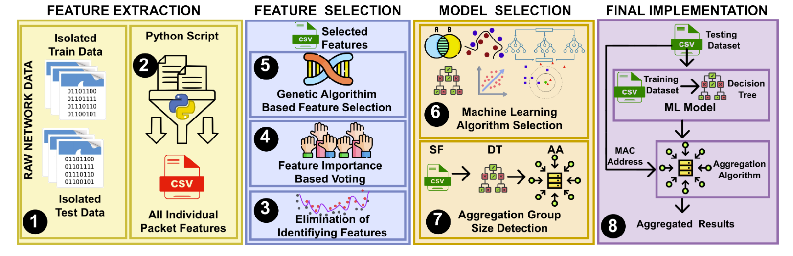

Dataset: https://www.unb.ca/cic/datasets/iotdataset-2023.html  
Previous Reference: https://www.unb.ca/cic/datasets/iotdataset-2022.html   
code reference: https://github.com/plumpmonkey/CICIoT2023 | https://github.com/kahramankostas/IoTDevID-CIC
## Threat Model，attacks
__User-Centered Environment:__ Smart Home

__Dataset:__ CICIoT up-to-date, real smart home setting, comprehensive     
__device category:__ camera, audio, home automation, power outlet

__Attack Groups:__ DoS, DDoS, Spoofing, Mirai, Web-based?   
__Prioritize threats:__ high-priority, likelihood occurance

## Mitagation
  

__Detection and classification: ML and DL__  
- binary classification: malicious or benign?
- grouped classification: attack groups
- multi-class classification: sub-group, attack identification   
_Maybe use RL for transferable framework?_

__security defense:__ Intrusion Detection and Prevention, access control, encryption, firewalls
