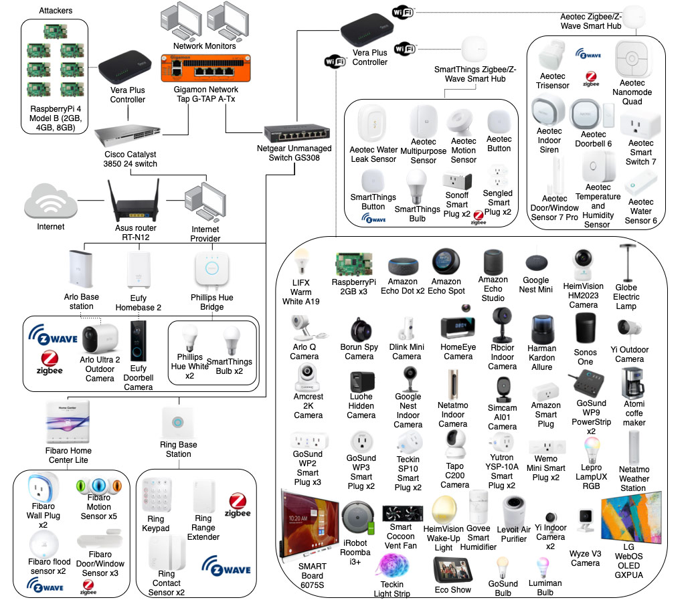
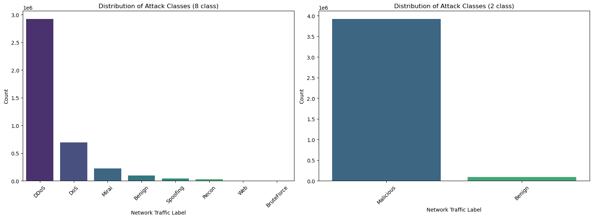
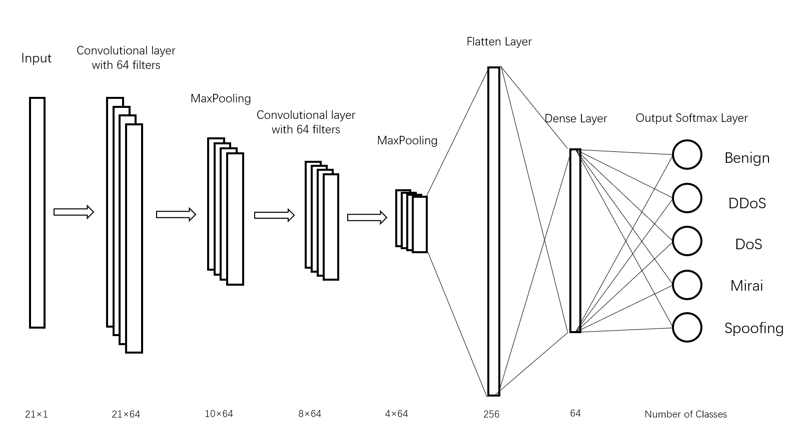
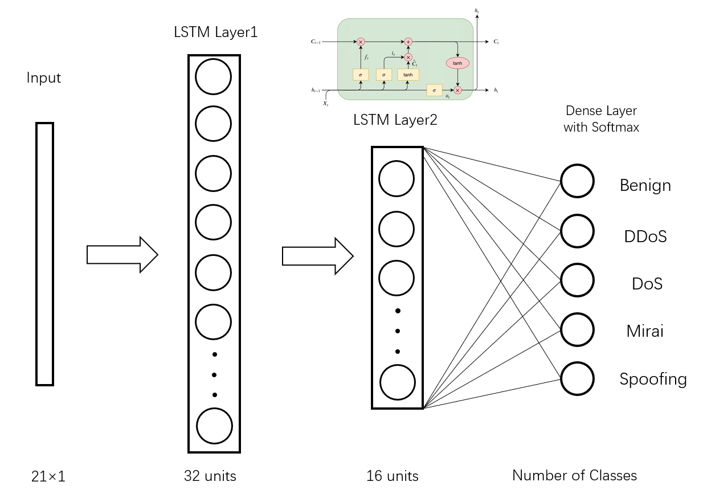
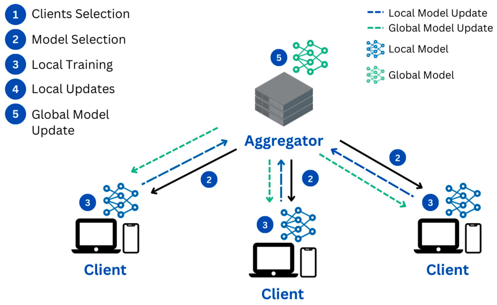
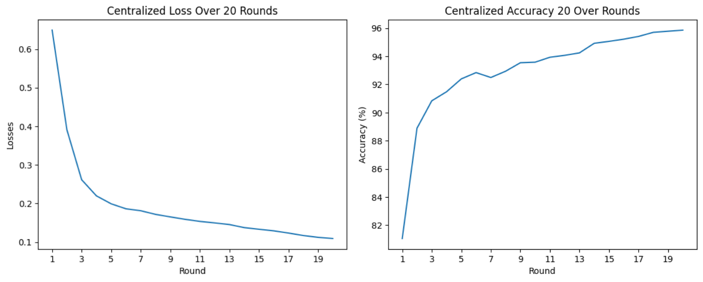

## Description
- Utilized datasets from the [CICIoT2023](https://www.unb.ca/cic/datasets/iotdataset-2023.html) dataset.
- Intrusion types are defined in DoS, DDoS, Mirai and Spoofing.  
- Trained various ML and DL models for intrusion detection and classification. Including RF, CNN, LSTM.
- Deployed models on the [Flower Framework](https://flower.ai/) to implement Federated Learning (FL).  
- Code is avaliable: https://github.com/CIRCIRCIRCLE/Security_GroupN

## Data Preprocessing, Threats and attacks types define
The project is based on CICIoT2023, below shows the IoT network topology:  

### Data Aggregation:  
  - code/data_aggregation
  - aggregate .csv datasets into .pkl files, 80%(135 files) into training set, 20%(34 files) into testing set.   
    _store under datasets/ 'training_data-X_values.pkl(12GB), training_data-y_value.pkl, test_data-X_values.pkl, test_data-y_value.pkl'_
### Data Triming:
  - The training set is over 12GB, which is hard to handle. Do data convert and sampling for the appropriate size.
  - Data convert based on data attributes: float64(46)-->bool(21), float16(2), float32(16), object(1), uint16(3), uint32(3)  12.5GB-->3.9GB 
  - Sampling: the resulting DataFrame contains a balanced representation of each class while reducing the overall number of rows based on the `specified percentage`.
### Attack Groups:  attack, category and subcategory labels
    - 2 classes: Benign or Malicious  
    - 8 classes: Benign, DoS, DDoS, Recon, Mirai, Spoofing, Web, BruteForce
    - 34 classes: subgroups of the above 8 classes
### Analysis of attack class distribution

The imbalanced data will hinder the model training process, I set up a filter and sampling function to select the targeted attack classes and samle a balanced dataset.

## Model Training and Deployment
### Models  
- Random Forest (RF)
- Convolutional Neural Network (CNN)
    
- Long-Short Term Memory (LSTM)
    

During model training, various features were extracted from network flow data. These models achieved exceptional performance with accuracy, precision, recall, and F1-score all exceeding 99%.

### Federated Learning Deployment
- The topology of Federated Learning

- Flower Framework and Tensorflow are used for the model deployment.  
- The tested model is CNN, while other models can be easily deployed.  
- The functions used in FL mainly contains __client__ and __server__. The client goes from the centralized workflow to the federated one, the server aggregates and updates parameters from federated sides. 

To simulate the process, the dataset will be partitioned into 20 pieces, each representing a different client based on their client ID (CID). The training process will start with at least 5 clients and will iterate for 20 rounds. Each client will undergo training for 2 epochs. The test results is shown below:    
___Simulation can be accessed here:___ 

## Summary
This security defense system used ML and DL models for precise attack classification in real-world IoT environments. To enhance user privacy, we integrate FL using the Flower framework. This approach enables accurate intrusion detection and attack identification directly on the user's device, ensuring both effective security protection and the generation of extensive data samples, all while maintaining a focus on user privacy. 