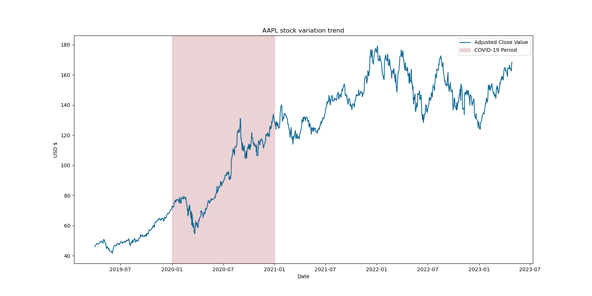
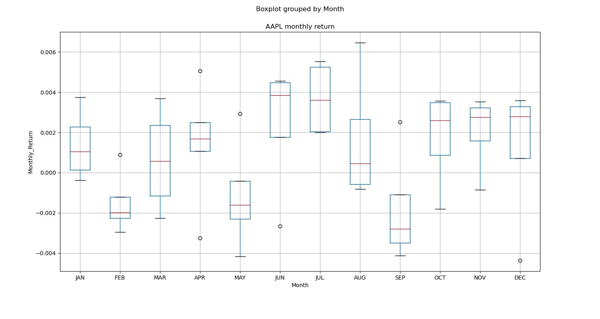
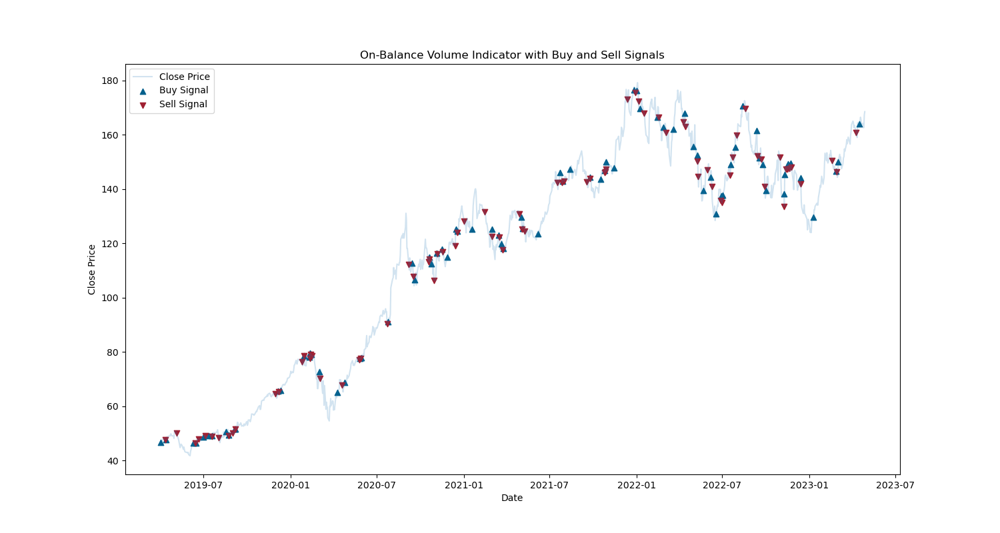
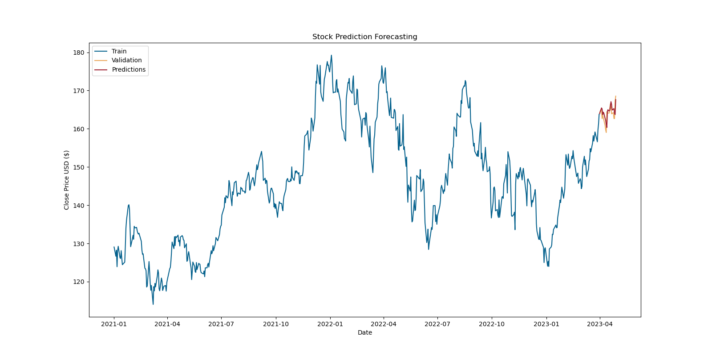

## Description
This project combines deep learning techniques, sentiment analysis and financial indicators to realize AAPL stock analysis and prediction. It contains the following sections: using API requests for data acquisition, using MongoDB Altas for data storage, using Flask local-based API for CRUD functions, using visualization tools and ARIMA for data exploration, using ntlk for sentiment analysis, using LSTM for model training and data forecasting.

___Index:___ Stock Price Prediction, Sentiment Analysis, LSTM, ARIMA, Time Series Forecasting, API Requests, NoSQL

__Github Repository:__ https://github.com/CIRCIRCIRCLE/Stock-Prediction-based-on-LSTM-and-Sentiment-Analysis

## Data
Raw format of stock data is from `IEX Cloud`, news headlines are from `New York Times and Financial Times`.

Two types of data were collected for stock forecasting: historical stock price data from 2019-04-01 to 2023-04-30 and corresponding news headlines from the same period. 

Data are gathered through API, and stored in MongoDB altas after preprocessing

## Exploratory Data Analysis
Preprocessing including missing value management and outlier detection.    
Data visualization including: Stock Variation Trend Over Time, Volume changes overtime, sentiment score distribution.    
Further exploration including: Overall trend with unusual behavior, Monthly Return, Hypothesis Testing, Seasonal Trend Analysis, Feature correlations, On-Balance Volume Indicators.   

## Model Training
Price Forecasting is conducted using Long-Short Time Series (LSTM) with the objective of predicting prices from April 1, 2023, to April 30, 2023, based on historical data. 

Model Training process also takes time, for code cleanness I stored the trained model under file model/:  
model 1: trained by historical close price from 2019-04-01 to 2023-03-31  
model 2: trained by historical close price from 2021-01-01 to 2023-03-31  
model 3: trained by historical close price and predicted sentiment scores from 2021-01-01 to 2023-03-31 

## Partial Results Display
### The overall trend of AAPL with covid-19 period highlighted

### Monthly return
- The highest range of returns occurred in March and August.
- February and April exhibited a relatively small interquartile range (IQR), indicating less variability in returns during these months.
- April, June, July, and December showed a low downside trade probability, with the minimum line close to the 25th percentile. This suggests that these months might provide favorable opportunities for entering the market with lower downside risk.

### Seasonality Adjustments
- In periods where market has strong bull or bear (upward or downward) trends, seasonality effects might be weak to observe. However, if market exhibits range bound behavior it, such effect can be more evident.
- As 2020 is the bull market year, 2022 is a ordinary market year. The figures below shows the seasonal adjustments performance of two kinds. The seasonality effect is more obvious in 2022.

.jpg)
.jpg)

### On Balance Volume Indicators

### LSTM Prediction using model3

## Summary 
This project successfully combines deep learning techniques, sentiment analysis, and financial indicators to analyze and forecast AAPL stock. While `seasonality and monthly return` provide a macro view, they are not obvious in strong bull or bear market trends. 

For accurate trend capture, `prediction` based on historical data plays a predominate role with the assistance of current public sentiment. `Decision-making` is guided by meaningful indicators such as `return threshold` and `on-balance volume`. Indeed, real-life stock fluctuations are influenced by numerous factors, making it challenging to accurately predict future directions. As a result, stock analysis and predictions hold guiding significance primarily in the short term.   

Challenges include data limitations and predicting within a constrained time range. The study showcases the potential of LSTM models and sentiment analysis in enhancing stock price predictions. Future improvements could involve acquiring more diverse sentiment data and refining decision-making algorithms for extended prediction periods. Overall, the project offers valuable insights into the integration of advanced analytics for informed stock market decisions.   
